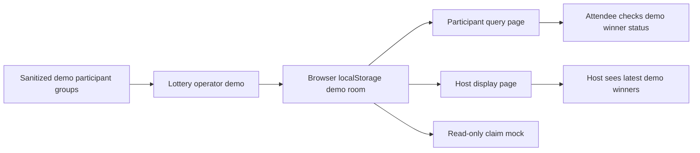

# Live Event Lottery System

## Summary

This project is a deployed event lottery system for a year-end style prize draw. It is strong portfolio evidence because reviewers can open real pages and see a complete multi-role workflow instead of only reading code names.

Live public pages:

- Lottery page: <https://byyoung184179.vercel.app/lottery.html?room=2026>
- Winner query page: <https://byyoung184179.vercel.app/check.html?room=2026>
- Host display page: <https://byyoung184179.vercel.app/hoster.html?room=2026>

The public deployment is now a sanitized portfolio demo. It uses fake participant data and browser `localStorage` so reviewers can test the flow without exposing real event data, database write access, participant spreadsheets, or operator controls.

## Product Problem

An event lottery needs several things to happen at the same time:

- Operators need to run prize draws from participant lists.
- Participants need a simple way to check whether they won.
- The host needs a synchronized winner list that updates immediately.
- Staff need a claim verification flow.
- The system should be usable without asking non-technical staff to install anything.

## What I Built

- A deployed Vercel web system with separate pages for lottery, query, host display, and claim verification.
- Room-based URLs using a `room` query parameter so event data can be separated by room or event.
- A public-safe demo state layer using browser storage events for cross-page synchronization.
- Winner query flow by participant name.
- Host-facing synchronized winner list with latest winners highlighted.
- Read-only claim desk mock for demonstrating the operational workflow without exposing admin actions.
- QR code support so attendees can open the query page quickly.
- Audio and visual effects for a more event-ready draw experience.

## Original Production-Oriented Design

The original event workflow included Firebase Realtime Database synchronization, Excel participant list loading, and claim status updates. Those parts demonstrate practical architecture decisions, but they were intentionally removed or mocked in the public version to avoid exposing operational data or writable backend behavior.

## Technical Signals

| Area | Evidence |
| --- | --- |
| Multi-role product flow | Separate pages for operator, participant, host, and claim verification roles |
| Real-time-style UX | Public demo syncs draw results across pages through local browser state and storage events |
| Deployment | Public Vercel pages can be reviewed directly |
| Data safety | Real participant spreadsheets and production database config are excluded from the public demo |
| UX design | Query page, highlighted latest host batch, draw effects, and QR entry points |
| Privacy judgment | Admin/claim flow is represented as read-only mock instead of public write access |

## Architecture

## AI-Assisted Engineering Workflow

I used AI coding agents as development accelerators, not as blind code generators. They helped me break the workflow into smaller tasks, compare implementation options, draft UI/state-management code, inspect error cases, and document the architecture. I still reviewed the generated code, tested the pages, checked privacy risks, and removed sensitive behavior before making the project public.

## Interview Talking Points

1. How room-based URLs keep event data separated.
2. How the original Firebase listener model supported live host display updates.
3. Why the public portfolio version uses local demo state instead of a production backend.
4. How Excel import made the original system usable for non-engineering event staff.
5. Why the product uses separate pages for different event roles.
6. How source cleanup balances portfolio proof with privacy and operational safety.

## Public Source Strategy

The deployed result is useful for HR review, and the public source has been cleaned for safer promotion:

- Removed client-side operator login logic.
- Removed public participant spreadsheets.
- Removed production Firebase reads/writes from public demo pages.
- Replaced operational admin behavior with a read-only claim mock.
- Kept real event data and sensitive operational details out of public materials.

## Portfolio Value

This project demonstrates the kind of practical engineering that hiring managers can evaluate quickly: a working deployed product, role-based workflow design, user-facing UX, demo-safe synchronization, and sound judgment about what not to expose publicly.
