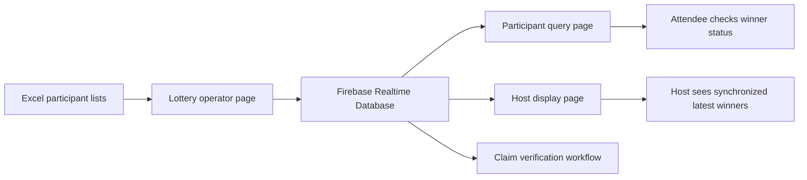

# Live Event Lottery System

## Summary

This project is a deployed event lottery system for a company year-end style prize draw. It is stronger portfolio evidence than a half-finished project because reviewers can open real pages and see a complete multi-role workflow.

Live public pages:

- Lottery page: <https://byyoung184179.vercel.app/lottery.html?room=2026>
- Winner query page: <https://byyoung184179.vercel.app/check.html?room=2026>
- Host display page: <https://byyoung184179.vercel.app/hoster.html?room=2026>

The claim/admin page exists in the product flow, but it should not be promoted as a public portfolio entry because it belongs to event operations and should be protected.

## Product Problem

An event lottery needs several things to happen at the same time:

- Operators need to run prize draws from participant lists.
- Participants need a simple way to check whether they won.
- The host needs a synchronized winner list that updates immediately.
- Staff need a claim verification flow.
- The system should be usable without asking non-technical staff to install anything.

## What I Built

- A deployed Vercel web system with separate pages for lottery, query, host display, and claim verification.
- Room-based URLs using a `room` query parameter so event data can be separated by room or event.
- Firebase Realtime Database integration for winner storage and live synchronization.
- Excel participant list loading for different participant groups.
- Winner query flow by participant name.
- Host-facing synchronized winner list with latest winners highlighted.
- Claim status handling for operational verification.
- QR code support so attendees can open the query page quickly.
- Audio and visual effects for a more event-ready draw experience.

## Technical Signals

| Area | Evidence |
| --- | --- |
| Real-time data | Firebase listeners update host and query pages without manual refresh |
| Deployment | Public Vercel pages can be reviewed directly |
| Product flow | Separate pages for operator, participant, host, and claim verification roles |
| Data import | Excel lists are parsed client-side for participant pools |
| UX design | Query page, highlighted latest host batch, draw effects, and QR entry points |
| Privacy judgment | Admin/claim flow is documented but not pushed as the main public demo |

## Architecture

## Interview Talking Points

1. How room-based URLs keep event data separated.
2. How Firebase `onValue` listeners support real-time host display updates.
3. How Excel import made the system usable for non-engineering event staff.
4. Why the product uses separate pages for different event roles.
5. What should be cleaned before promoting the source repository more widely.

## Public Source Strategy

The deployed result is useful for HR review, but the source should be cleaned before heavy public promotion:

- Move any management password or operational secret out of client-side code.
- Verify Firebase Database rules so public clients can only perform intended actions.
- Replace real event data, company-specific media, and operational details with demo data.
- Keep claim/admin links out of the primary public showcase unless the flow is protected and sanitized.

## Portfolio Value

This project demonstrates the kind of practical engineering that hiring managers can evaluate quickly: a working deployed product, real-time synchronization, role-based workflow design, user-facing UX, and sound judgment about what not to expose publicly.
